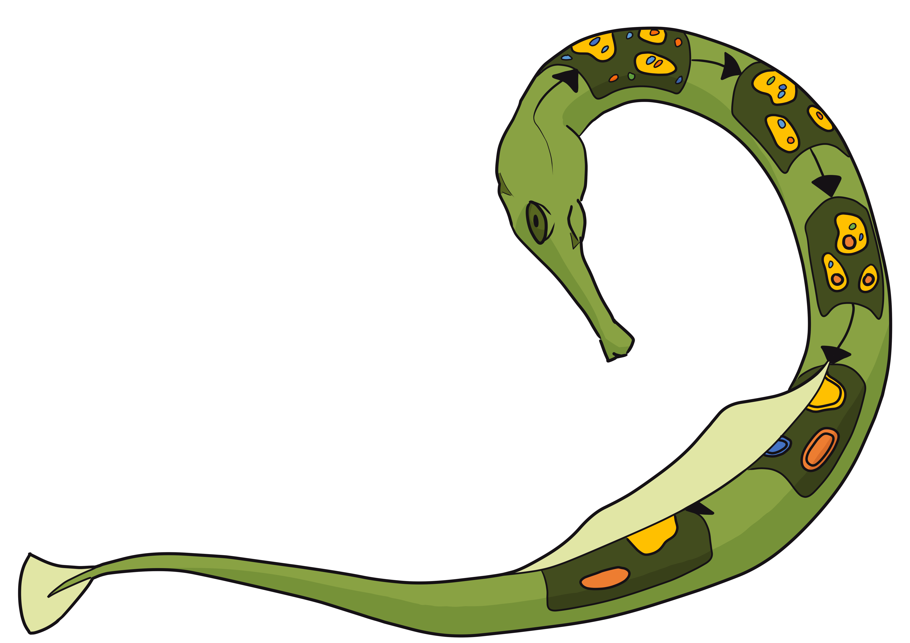

[](https://travis-ci.com/hubmapconsortium/spatial-transcriptomics-pipeline)
[](https://github.com/psf/black)

# PIPEFISH, the HuBMAP Spatial Transcriptomics Pipeline

A [CWL](https://www.commonwl.org/) pipeline for processing spatial transcriptomics data.

* [Installation](#installation)
   * [Method 1: Local Python Install](#method-1-local-python-install)
   * [Method 2: Running in a Docker container](#method-2-running-in-a-docker-container)
* [Example PIPEFISH Run](#example-pipefish-run)
* [Overall Program Flow](#overall-program-flow)
* [Inputs](#inputs)
   * [File Inputs](#file-inputs)
      * [Needed for Pipeline Run](#needed-for-pipeline-run)
         * [Psuedoround Sorting](#psuedoround-sorting)
         * [Raw Dataset](#raw-dataset)
         * [Segmentation](#segmentation)
      * [Only Needed for Individual Steps](#only-needed-for-individual-steps)
         * [Image Processing](#image-processing)
         * [Image Decoding](#image-decoding)
         * [QC](#qc)
   * [Non-File Inputs](#non-file-inputs)
      * [Overall pipeline.cwl Program Flow](#overall-pipelinecwl-program-flow)
         * [Parameters Applied Over Multiple Stages](#parameters-applied-over-multiple-stages)
      * [Dataset Information](#dataset-information)
         * [File Formatting](#file-formatting)
         * [Auxiliary View Formatting](#auxiliary-view-formatting)
      * [Image Processing](#image-processing-1)
      * [Image Decoding](#image-decoding-1)
      * [Segmentation](#segmentation-1)
      * [QC](#qc-1)
* [Development](#development)
   * [Building Docker images](#building-docker-images)
   * [Release process](#release-process)

## Installation

This pipeline is compatible with Linux and Mac systems. Windows users can run the pipeline by installing [WSL2](https://learn.microsoft.com/en-us/windows/wsl/install) and taking [extra steps](https://docs.docker.com/desktop/windows/wsl/) to configure Docker Engine.

### Method 1: Local Python Install
1. Prerequisites: [Docker Engine](https://docs.docker.com/engine/install/) and Python > 3.7.
2. Clone this repo with `git clone -b release https://github.com/hubmapconsortium/spatial-transcriptomics-pipeline.git`.
3. Install `cwltool` with `pip install cwltool`.
4. You can now run `pipeline.cwl` and the step files included in `/steps` by using `cwltool [file].cwl [inputs]`. *Note: A long list of warnings is expected due to the way the pipeline fails with an explanation if incorrect inputs are provided. The tool ran successfully if the final output is `Final process status is success`.*

### Method 2: Running in a Docker container
This method is not recommended due to creating additional computational overhead, but can be useful in situations where the pipeline is deployed as a job on a cloud computer, such as kubernetes. The exact steps to run remotely will vary depending on infrastructure.
1. Prerequisites: Install [Docker Engine](https://docs.docker.com/engine/install/).
2. Obtain the runner image with `docker pull ghcr.io/hubmapconsortium/spatial-transcriptomics-pipeline/starfish-docker-runner:latest`.
3. Refer to [Docker mount documentation](https://docs.docker.com/storage/bind-mounts/) for directions on how to make input/output directories accessible to the docker image. Run the docker image as `docker run --name PIPEFISH --mount [your mount string] ghcr.io/hubmapconsortium/spatial-transcriptomics-pipeline/starfish-docker-runner:latest`.
4. Run PIPEFISH inside the docker image the same as you would in **Method 1** with `docker exec -d PIPEFISH cwltool --singularity --outdir [defined in prior step] [step].cwl [input parameters]`. *Note: A long list of warnings is expected due to the way the pipeline fails with an explanation if incorrect inputs are provided.*
## Example PIPEFISH Run
1. Download and extract one of our [pre-formatted, open-access datasets](https://zenodo.org/record/7647746). *The mouse brain ISS data is recommended as a first choice due to filesize and short run time.*
2. From inside the extracted directory, run the provided `prep_input.py` script. This will generate a `pipeline.yml` file with absolute paths to the downloaded data.
3. The pipeline can now be run with `cwltool {path to cloned repo}/pipeline.cwl {path to downloaded data}/pipeline.yml`. *Note: A long list of warnings is expected due to the way the pipeline fails with an explanation if incorrect inputs are provided.*

The two provided input text files for the pipeline, `pipeline.yml` and `*metadata.json`, can be used as a template for new runs.

## Overall Program Flow


## Inputs
Necessary parameters can be passed in through a `yml` file, or inline if the remaining required parameters are specified through the `parameter_json` input file. Nested entries need to be provided as input records (`yml`) or as a nested dictionary (`json`). Variable types noted with a *?* are optional inputs.

**File inputs cannot be provided through `json` input, and must be provided either in-line or as a `yml`**. A combination of `yml` and `json` input can be used, and it is recommended to store all values that will be true for any run of a dataset in the `json` file, and to store anything that may be run-dependent (ex. `selected_fovs` or `n_processes`) in the `yml` file. For any parameter defined in both the `yml` and `json` inputs, the `json` input takes priority.

Input parameters are as follows:

### File Inputs
These inputs cannot be passed as a part of `json` input, and many are only used when individual steps are run independently as they are automatically populated by output from prior steps during a pipeline run.

#### Needed for Pipeline Run

##### Psuedoround Sorting
For experiments where the true rounds and channels are converted to stacked “pseudo” rounds, the following information is needed to convert the images from trueround to pseudoround format.  *Note that it is assumed that the images are the only thing referred to by their respective true imaging rounds, and that all the other variables provided above and in the codebook refer to pseudorounds and pseudochannels.*

The following are needed as inputs to `sorter.cwl`, as well as those specified in the "Dataset Formatting" section.

- `channel_yml` *File*
  PyYML-formatted list containing dictionaries outlining how the imaging truechannels relate to the pseudochannels in the decoding codebook. The index of each dict within the list is the trueround % (count of pseudorounds). The keys of the dict are the channels within the image and the values are the pseudochannels in the converted notebook.
- `cycle_yml` *File*
  PyYML-formatted dictionary outlining how the truerounds in imaging relate to the pseudorounds in the decoding codebook. The keys are truerounds and the values are the corresponding pseudorounds.

##### Raw Dataset
The following parameters will be used by either `spaceTxConversion.cwl` or by `sorter.cwl`, if pseudoround sorting is applied.
- `input_dir` *Directory*
  Root directory containing all images.
- The codebook for the experiment must be provided in one of two formats:
  - `codebook_csv` *File*
    CSV containing codebook information for the experiment. Rows are barcodes and columns are imaging rounds. Column IDs are expected to be sequential, and round identifiers are expected to be integers (not roman numerals).
  - `codebook_json` *File*
    JSON containing codebook information for the experiment, as formatted by Starfish.

##### Segmentation
There are five possible segmentation methods in this pipeline. If cellpose integration or external segmentation are to be used external files must be provided. Other parameters may be passed as `json` input.

- External Segmentation
  1. External roi_set, such as from FIJI segmentation.
     - `mask_roi_files` *directory*
        Directory containing `RoiSet.zip` for each FOV.
     - `mask_roi_formats` *string*
        Layout of the name of each zip folder, per FOV.  Will be formatted as `file_formats.format([fov index])`.
  2. External labeled binary image.
     - `mask_labeled_files` *directory*
        Directory containing labeled segmentation images, such as from ilastik classification.
     - `mask_labeled_formats` *string*
        Layout of the name of each labelled image.  Will be formatted with `file_formats_labeled.format([fov index])`.
- Cellpose Segmentation
   - `pretrained_model_dir` *file*
      If a user-defined moded is to be used, then this file must be provided.

#### Only Needed for Individual Steps
The following parameters are only needed for running individual steps, such as for debugging. In a pipeline run, these will be automatically populated by prior steps.

##### Image Processing
- `input_dir` *directory*
  Root directory that contains Starfish-formatted data, such as `2_tx_converted`.

##### Image Decoding
- `exp_loc` *directory*
  Root directory that contains Starfish-formatted data, such as `3_processed`.

##### Segmentation
- `decoded_loc` *directory*
  Root directory from image decoding step, such as `4_Decoded`.
- `exp_loc` *directory*
  Location of directory containing `experiment.json` file, typically `3_processed`.

##### QC
- `codebook_exp` *Directory*
  Directory containing both an `experiment.json` file and `codebook.json`, such as `2_tx_converted` or `3_processed`.
- `segmentation_loc` *directory*
  Directory containing segmented data from an experiment, such as `5_Segmentation` or `6_Baysor`.
- `data_exp` *directory*
  Directory containing decoded data from an experiment, such as `4_Decoded`.

### Non-File Inputs
All of these parameters may be passed as a part of `json` input.

#### Overall pipeline.cwl Program Flow
The following parameters can be used when invoking the entire pipeline through `pipeline.cwl` to change which steps are run.

- `skip_formatting` *boolean?*
  If true, the stages of *Pseudoround Sorting* and *SpaceTx Conversion* will be skipped.
- `skip_processing` *boolean?*
  If true, the stage of *Image Processing* will be skipped.
- `run_baysor` *boolean?*
  If true, the stage of *Baysor* will be run after segmentation. **Only works with 2D Datasets**.
- `skip_qc` *boolean?*
  If true, the stage of *QC* will be skipped.

##### Parameters Applied Over Multiple Stages

- `selected_fovs` *int[]?*
  If provided, any stage after *SpaceTx Conversion* will only run on the selected FOVs. Useful for running large datasets in environments with limited disk space.

  Results from partial-fov runs can be combined by merging output folders. **The only files that need modification are in `3_processing`**. Due to how starfish loads Experiment files, the `json` files for each view (including the primary view) will need to merge the 'contents' field across runs to include all relevant FOVs.
- `n_processes` *int?*
  The number of processes to be used for computationally intense methods in *Image Processing* and *Decoding*. If not provided, this will set this to the number of logical processors on the system, which are not guaranteed to be accessible if the tool is run on a shared cluster. If the number of logical processors cannot be determined for some reason, it will default to 1.


#### Dataset Information

If these fields were not specified for `sorter.cwl`, they must be satisfied for `spaceTxConversion.cwl`.
- `fov_count` *int*
  The number of FOVs in the experiment
- `round_count` *int*
  The number of imaging rounds in the experiment.
- `zplane_count` *int*
  The number of z-planes in each image.
- `channel_count` *int*
  The number of total channels per imaging round.
- `cache_read_order` *string[]*
  Describes the order of the axes within each individual image file.  Accepted values are CH, X, Y, Z.

Optional variables that describe the real-world locations of each fov and size of each voxel.  These must be all unspecified or all specified.  Required for QC to run.
- `x_locs`, `y_locs`, `z_locs` *float[]*
  List of the n-axis start location per FOV index.
- `x_shape`, `y_shape`, `z_shape` *int*
  Length of the n-axis across all FOVs.
- `x_voxel`, `y_voxel`, `z_voxel` *float*
  Size of voxels along the n-axis.

##### File Formatting
- `round_offset` *int?*
  The index of the first round in the file name. Defaults to 0.
- `fov_offset` *int?*
  The index of the first FOV in the file name. Defaults to 0.
- `channel_offset` *int?*
  The index of the first channel in the file name. Defaults to 0.
- `file_format` *string*
  String with directory/file layout for .tiff files. Tile-specific values will be inserted into this string using the [python .format function](https://docs.python.org/3/library/string.html#formatstrings), with the order specified in “file_vars”.
- `file_vars` *string[]*
List of strings with variables to insert into “file_format”.  The following values are accepted.
  - `channel`
  - `offset_channel` (channel + channel_offset)
  - `round`
  - `offset_round` (round + round_offset)
  - `fov`
  - `offset_fov` (fov + fov_offset)
  - `zplane`
  - `offset_zplane` (zplane + zplane_offset)

##### Auxiliary View Formatting
The following variables describe the structure of auxiliary views, if any are present.  There must be as many entries in these lists as there are aux views, unless otherwise noted.  If `json` input is being used and there are no aux views, an empty list must be provided for the key `aux_tilesets`.
- `aux_tilesets`:
  - `aux_names` *string[]*
    The name for each auxiliary view.
  - `aux_file_formats` *string[]*
    The same as “file_format”, for each auxiliary view.
  - `aux_file_vars` *string[][]*
    The same as “file_vars”, for each auxiliary view.
  - `aux_cache_read_order` *string[]*
    The same as “cache_read_order”, for each auxiliary view.
  - `aux_channel_count` *int[]*
    The number of channels in each aux view.
  - `aux_channel_slope` *float[]*
    Used to convert 0-indexed channel IDs to the channel within the image, in the case that aux views use higher-indexed channels in an image already used in another view.  Defaults to 1.
    Calculated as :
      `Image index = int(index * channel_slope) + channel_intercept`
  - `aux_channel_intercept` *int[]*
    Used to convert 0-indexed channel IDs to the channel within the image, in the case that aux views use higher-indexed channels in an image already used in another view.  See above calculation. Defaults to 0.

#### Image Processing
The following are used in `processing.cwl` for basic image formatting.
- `clip_min` *float?*
  Pixels with brightness below this percentile are set to zero. Defaults to 0.
- `clip_max` *float?*
  Pixels with brightness above this percentile are set to one. Defaults to 99.9.
**Note**: if both `clip_min` and `clip_max` are set to 0, the step will be skipped.
- `register_aux_view` *string?*
  The name of the auxiliary view to be used for image registration.  If not provided, no registration will happen.
- `channels_per_reg` *int?*
  The number of images associated with each channel in the registration image. Defaults to 1. **only needed when running this step individually, calculated automatically as a part of the pipeline.**
- `background_view` *string?*
  The name of the auxiliary view to be used for background subtraction.  Background will be estimated if not provided.

- `anchor_view` *string?*
  The name of the auxiliary view to be processed in parallel with primary view, such as for anchor round in ISS processing. Will not be included if not provided.
- `high_sigma` *int?*
  Sigma value for high pass gaussian filter. Will not be run if not provided.
- `deconvolve_iter` *int?*
  Number of iterations to perform for deconvolution. High values remove more noise while lower values remove less. The value 15 will work for most datasets unless image is very noisy. Will not be run if not provided.
- `deconvolve_sigma` *int?*
  Sigma value for deconvolution. Should be approximately the expected spot size. Must be provided if `deconvolve_iter` is provided.
- `low_sigma` *int?*
  Sigma value for low pass gaussian filter. Will not be run if not provided.
- `rolling_radius` *int?*
  Radius for rolling ball background subtraction. Larger values lead to increased intensity evening effect. The value of 3 will work for most datasets. Will not be run if not provided.
- `match_histogram` *boolean?*
  If true, histograms will be equalized. Defaults to false.
- `tophat_radius` *int?*
  Radius for white top hat filter. Should be slightly larger than the expected spot radius. Will not be run if not provided.

#### Image Decoding
The following are used in `starfishRunner.cwl`, which is effectively a wrapper for the starfish spot detection/decoding methods.
- `use_reference_image` *boolean?*
  If true, a max projection image will be generated and used as a reference for decoding.
- `anchor_view` *string?*
  The name of the auxiliary view to be used as a reference view, such as for anchor round in ISS processing. Will not be included if not provided.
- `is_volume` *boolean?*
  Whether to treat zplanes as a 3D image. Defaults to False.
- `rescale` *boolean?*
  Whether to iteratively rescale image intensity before running the decoder. Can be run with any decoder, but requires that a valid set of parameters are provided to `decoding_pixel`.
- `not_filtered_results` *boolean?*
  If true, will not remove genes that do not match a target and do not meet criteria. Defaults to false.
- **Blob-based Decoding** `decoding`
  Will run decoding in two steps, [blob detection](https://spacetx-starfish.readthedocs.io/en/stable/api/spots/index.html?highlight=blobdetector#starfish.spots.FindSpots.BlobDetector) followed by decoding.
  - `min_sigma` *float[]?*
    Minimum sigma tuple to be passed to blob detector. Defaults to (0.5, 0.5, 0.5).
  - `max_sigma` *float[]?*
    Maximum sigma tuple to be passed to blob detector. Defaults to (8, 8, 8).
  - `num_sigma` *int?*
    Number of sigma values to be tested. Defaults to 10.
  - `threshold` *float?*
    Threshold of likeliness for a spot to be valid. Defaults to 0.1.
  - `overlap` *float?*
    Amount of overlap allowed between blob. Defaults to 0.5.
  - `detector_method` *string?*
    The name of the sciki-image spot detection method to use.  Valid options are `blob_dog`, `blob_doh`, and `blob_log` (default).
  - `composite_decode` *boolean?*
    Whether to composite all FOVs into one image, typically for PoSTcode decoding.
  - `composite_pmin` *float?*
    pmin value for clip and scale of composite image.
  - `composite_pmax` *float?*
    pmax value for clip and scale of composite image.
  - `decode_method` *string?*
    Method name for spot decoding.  Valid options and corresponding required parameters are listed below.
  - `decoder`
    - `SimpleLookupDecoder`
      Does not have any further parameters.
    - [`postcodeDecode`](https://github.com/gerstung-lab/postcode)
      Does not have any further parameters.
    - [`MetricDistance`](https://spacetx-starfish.readthedocs.io/en/stable/api/spots/index.html#starfish.spots.DecodeSpots.MetricDistance)
      - `trace_building_strategy` *string*
        Which tracing strategy to use.  Valid options are `SEQUENTIAL`, `EXACT_MATCH`, `NEAREST_NEIGHBOR`.
      - `max_distance` *float*
        Spots greater than this distance from their nearest target are not decoded.
      - `min_intensity` *float*
        Spots dimmer than this intensity are not decoded.
      - `metric` *string?*
        Can be any metric that satisfies the triangle inequality that is implemented by [`scipy.spatial.distance`](https://docs.scipy.org/doc/scipy/reference/spatial.distance.html#module-scipy.spatial.distance). Defaults to `euclidean`.
      - `norm_order` *int?*
        the norm to use to normalize the magnitudes of spots and codes. Defaults to 2, the L2 norm.
      - `anchor_round` *int?*
        Round to use as “anchor” for comparison. Optional.
      - `search_radius` *int?*
        Distance to search for matching spots, only if `trace_building_strategy` is set to `NEAREST_NEIGHBOR`. Optional.
      - `return_original_intensities` *boolean?*
        Return original intensities instead of normalized ones.  Defaults to False.
    - [`PerRoundMaxChannel`](https://spacetx-starfish.readthedocs.io/en/stable/api/spots/index.html#starfish.spots.DecodeSpots.PerRoundMaxChannel)
      - `trace_building_strategy` *string*
         Which tracing strategy to use.  Valid options are `SEQUENTIAL`, `EXACT_MATCH`, `NEAREST_NEIGHBOR`.
      - `anchor_round` *int?*
         Round to use as “anchor” for comparison. Optional.
      - `search_radius` *int?*
         Distance to search for matching spots, only if `trace_building_strategy` is set to `NEAREST_NEIGHBOR`. Optional.
    - [`CheckAll`](https://github.com/nickeener/starfish/blob/master/starfish/core/spots/DecodeSpots/check_all_decoder.py)
      - `search_radius` *int?*
         Distance to search for matching spots.  Defaults to 3.
      - `error_rounds` *int*
         Maximum hamming distance a barcode can be from its target and still be uniquely identified.  Defaults to 0.
      - `mode` *string?*
         Accuracy mode to run in.  Can be 'high', 'med', or 'low'. Defaults to 'med'.
      - `physical_coords` *boolean?*
         Whether to use physical coordinates or pixel coordinates. Defaults to False.
- **Pixel-based Decoding** `decoding`
  Will run decoding in one step using the [`PixelSpotDecoder`](https://spacetx-starfish.readthedocs.io/en/stable/api/spots/index.html#starfish.spots.DetectPixels.PixelSpotDecoder)
  - `metric` *string?*
    The sklearn metric to pass to NearestNeighbors. Defaults to 'euclidean'.
  - `distance_threshold` *float*
    Spots whose codewords are more than this metric distance from an expected code are filtered.
  - `magnitude_threshold` *float*
    Spots with less than this intensity value are filtered.
  - `min_area` *int?*
    Spots with total area less than this value are filtered. Defaults to 2.
  - `max_area` *int?*
    Spots with total area greater than this value are filtered. Defaults to `np.inf`
  - `norm_order` *int?*
    Order of L_p norm to apply to intensities and codes when using metric_decode to pair each intensity to its closest target.  Defaults to 2.

#### Segmentation
Used by `cellpose.cwl` or `segmentation.cwl`. Results from this step will be run through Baysor if `run_baysor` is set to `True`. Note that Baysor will only run on 2D data.

Depending on pre-existing segmentation data, one of five methods can be used. If a cellpose custom model, roi_set, or labeled images are to be used, those must be provided as [file inputs](#file-inputs) and `binary_mask` should be provided as `binary_mask: {}`

- **Cellpose segmentation**
  - `use_mrna` *boolean?*
    If true, decoded transcripts will be incorporated into segmentation.
  - `use_gpu` *boolean?*
    If true, GPU will be used for computation instead of CPU.
  - `pretrained_model_str` *string?*
    One of the [pretrained models](https://cellpose.readthedocs.io/en/latest/models.html) for cellpose. This model or a custom model must be provided.
  - `diameter` *float?*
    Expected diameter of cells. Only needs to be provided if a pre-trained model is used.
  - `flow_threshold` *float?*
    Threshold for filtering cell segmentations (increasing this will filter out lower confidence segmentations). Range is 0 to infinity.
  - `stitch_threshold` *float?*
    Threshold for stiching together segmentations that occur at the same xy location but in adjacent z slices, fange is 0 to 1. This should only be used when the image is 3D.
  - `cellprob_threshold` *float?*
    Determins the extent of the segmentations (0 is the default more negative values resulting in larger cells, more positive values result in smaller cells), range is -6 to 6.
  - `border_buffer` *int?*
    If not None, removes cytoplasms whose nuclei lie within the given distance of the FOV border.
  - `label_exp_size` *int?* Pixel size labels are dilated by this much in the final step. Helpful for closing small holes that are common from thresholding but can also cause cell boundaries to exceed their true boundaries if set too high. Label dilation respects label borders and does not mix labels.
  - `min_allowed_size` *int?*
    Minimum size for a cell (in pixels).
  - `max_allowed_size` *int?*
    Maximum size for a cell (in pixels).
- **Any other segmentation** *including imported external masks*
  - `aux_name` *string?*
    The name of the aux view to look at for segmentation. May not required depending on `binary_mask` settings.
  - `binary_mask`
    - Threshold and watershed segmentation (no provided data)
      - `img_threshold` *float*
         Global threshold value for images.
      - `min_dist` *int*
         Minimum distance (in pixels) between transformed peaks in watershedding.
      - `min_allowed_size` *int*
         Minimum size for a cell (in pixels).
      - `max_allowed_size` *int*
         Maximum allowed size for a cell (in pixels).
      - `masking_radius` *int*
         Radius for white tophat noise filter.
    - Transcript-density based segmentation (provided transcript data)
      - `nuclei_view` *string*
         Name of the auxillary view with nuclei data
      - `cyto_seg` *boolean*
         If true, the cytoplasm will be segmented.
      - `correct_seg` *boolean*
         If true, suspected nuclei/cytoplasms that overlap will be removed.
      - `border_buffer` *int*
         If not zero, removes cytoplasms whose nuclei lie within the given distance from the border.
      - `area_thresh` *float*
         Threshold used when determining if an object is one nucleus or two or more overlapping nuclei. Objects whose ratio of convex hull area to normal area are above this threshold are removed if the option to remove overlapping nuclei is set.
      - `thesh_block_size` *int*
         Size of structuring element for local thresholding of nuclei. If nuclei interiors aren't passing threshold, increase this value, if too much non-nuclei is passing threshold, lower it.
      - `watershed_footprint_size` *int*
         Size of structuring element for watershed segmentation. Larger values will segment the nuclei into larger objects and smaller values will result in smaller objects. Adjust according to nucleus size.
      - `label_exp_size` *int*
         Pixel size labels are dilated by in final step. Helpful for closing small holes that are common from thresholding but can also cause cell boundaries to exceed their true boundaries if set too high. Label dilation respects label borders and does not mix labels.

#### QC
- `find_ripley` *boolean?*
  If true, Ripley's Spatial Statistic will be run on spot data. Defaults to False.
- `save_pdf` *boolean?*
  If true, all QC metrics will save plots to pdf. If false, only `yml` output will be provided. Defaults to True.
Note: Some values from earlier stages are optionally read in to provide select metrics. If not using singular `json` file as input, refer to `input_schemas/qc.json` for values that can be passed for more precise results.

## Development
Code in this repository is formatted with [black](https://github.com/psf/black) and
[isort](https://pypi.org/project/isort/), and this is checked via Travis CI.

Currently, development is performed on the `master` branch, for the latest stable release use the `release` branch.

A [pre-commit](https://pre-commit.com/) hook configuration is provided, which runs `black` and `isort` before committing.
Run `pre-commit install` in each clone of this repository which you will use for development (after `pip install pre-commit`
into an appropriate Python environment, if necessary).

### Building Docker images
Run `build_docker_images` in the root of the repository, assuming you have an up-to-date
installation of the Python [`multi-docker-build`](https://github.com/mruffalo/multi-docker-build)
package.

### Release process

The `master` branch is intended to be production-ready at all times, and should always reference Docker containers
with the `latest` tag.

Publication of tagged "release" versions of the pipeline is handled with the
[HuBMAP pipeline release management](https://github.com/hubmapconsortium/pipeline-release-mgmt) Python package. To
release a new pipeline version, *ensure that the `master` branch contains all commits that you want to include in the release,*
then run
```shell
tag_release_pipeline v0.whatever
```
See the pipeline release management script usage notes for additional options, such as GPG signing.
